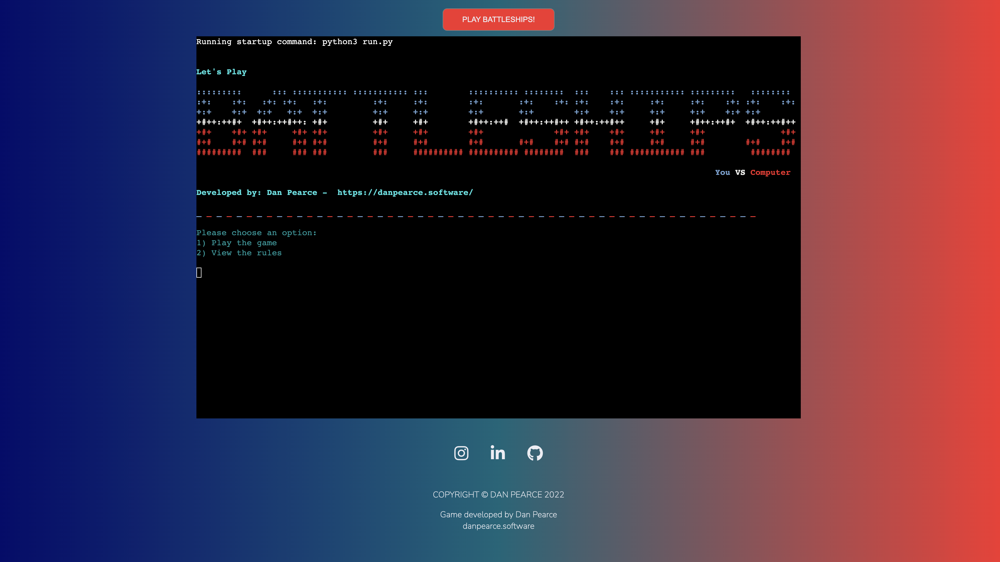

# Battleships! - The command-line version of the all time classic!
Developed by, [Dan Pearce](https://danpearce.software/)

[View the live application](https://ci-pp3-battleships-danpearce.herokuapp.com/)

This version of Battleships has been developed using the Python language, and is intended to be a single player game where the user will play against the computer to try and win the game!

The application has been uploaded to Heroku for convience for the user to play online, however if downloaded the game could also be played on any computer in the terminal/command-line!

## Contents
1. [Application Goals and Consumer Experience](#application-goals-and-consumer-experience)
    - [Consumer Goals](#consumer-goals)
    - [Owner Goals](#owner-goals)
    - [Target Audience](#target-audience)
    - [Consumer Expectations](#consumer-expectations)
    - [Consumer Manual](#consumer-manual)
2. [User Stories](#user-stories)
    - [User](#user)
    - [Owner](#owner)
3. [Design](#design)
    - [Structure](#structure)
    - [Flowchart](#flowchart)
    - [Colour](#colour)
4. [Main Features](#main-features)
5. [Technologies](#technologies)
    - [Languages](#languages)
    - [Libraries](#libraries)
    - [Frameworks and Other Technologies](#frameworks-and-other-technologies)
6. [Validation and Testing](#validation-and-testing)
    - [Python PEP8 Testing](#python-pep8-testing)
    - [User Story Testing](#user-story-testing)
7. [Bugs and Errors](#bugs-and-errors)
8. [Deployment](#deployment)
9. [Credits](#credits)
10. [Acknowledgements](#acknowledgements)

## Application Goals and Consumer Experience

### Consumer Goals
- Play a fun and interactive version of Battleships.
- Easily navigate around the game, with added prompts on how to play.
- Easily find the rules of the game, especially needed for new consumers.
- Try to win agasint the computer!

### Owner Goals
- Provide the consumer with an interactive game.
- Ensure the consumer is prompted throughout the game.
- Ensure the consumer is notified of errors, so they can be rectified.
- Let the consumer know if they have lost or won.
- Give the consumer the option to play again, or to quit.

### Target Audience
- Anybody who would like to play a game of Battleships against the computer.
- Fellow coder's who want to see how Battleships in Python works.
- Anyone with an interest in Video Games.

### Consumer Expectations
- To play a game of Battleships, with preferably no errors.
- To be given details on each part of the game - differentriate between placing and guessing.
- Key prompts at each stage of the game.
- Easy and simple navigation.

### Consumer Manual

View the manual here

#### Application Loaded
Upon loading the game via Heroku the consumer is presented with a simple landing HTML document, that details the developer's socials and displays a terminal on the web page. If loaded on a PC only the game itself will just load.

When loaded the consumer is presented with the title of the game which is presented using ASCII art and this is then followed by the main menu.

#### Main Menu
The main menu consists of the two main features of the game; either allowing the consumer to play the game, or if unfamiliar with the rules they have the option to view the rules.

The consumer is presented with a menu as followed:
1. Play the game - which will start the game
2. View the rules - which will load the game rules

If the consumer inputs an incorrect key they are prompted and issued a warning in red to highlight the issue.

#### View Rules
Upon selecting this option, the consumer is presented a visual step by step guide on how to play the game! At the end of this the consumer is again presented with options which are as followed:
1. Play the game - which will start the game
2. Return to the main menu - which loads the main menu

#### Play Game
When the game is loaded the consumer is again presented with the title of the game on a 'new'/cleared screen and is shown a visual representation of their board! This will be the board they are prompted to place thier ships!

The computer in the background will randomly place its ships when play game is selected.

#### Place Ships - User Prompting
Just after the consumer can see thier board, they will be prompted to place their ships - and will be told each time how many spaces wide their ships will be.

The consumer will then be asked if they'd like to place their ship Vertically(V), or Horizontially(H), which row(1-8) they'd like to select and which column(A-H) they'd like to select.

The ships that are placed will be visually represented by 'X' 's on the board.

If they consumer tries to place a ship that will go off the board; they are prompted with a warning in red and the steps will repeat.

If the consumer tries to place a ship that will go over another ship; they are prompted with a warning in red and the steps will also repeat again.

If the consumer inputs an incorrect key they are prompted and issued a warning in red to highlight the issue.

#### Ships Placed
Once all ships are placed, the consumer is presented with their placed ships board to remind them of where there ships have been placed and also with a new board - which will be their guessing board.

#### Guess Ships
When the consumer is presented with their guessing board, they will be prompted to guess a row(1-8) and to guess a column(A-H). This will be then checked agaisnt the random board that the computer generated right at the start of the game.

If the consumer gets a 'hit' the board will visally show them an 'X' in the computers colour, if not the they will see '~' to represent water.

The computer will randomly select a place to guess for it's ships to guess too. Displaying the opposite in colours.

Both boards will be displayed for visual impact.

If the consumer attempts to place a guess somewhere they have already guessed, they will be prompted in red and asked to try again. The computer will automatically try again if already guessing in the same spot.

If the consumer inputs an incorrect key they are prompted and issued a warning in red to highlight the issue.

#### Game Result
When all 'X' 's have been revealed on either board - the consumer will be presented with the fact that they either lost, or they won!

The consumer is then presented with more options:
1. Return to main menu
2. Quit game

#### Quit Game
Upon deciding to quit, the consumer is presented with a visual goodbye screen and the application will cease to run. 

## User Stories

### User

### Owner

## Design

### Structure

### Flowchart

### Colour

## Main Features

## Technologies

### Languages

### Libraries

### Frameworks and Other Technologies

## Validation and Testing

### Python PEP8 Testing

### User Story Testing

## Bugs and Errors

## Deployment

## Credits

## Acknowledgements
