# Battleships! - The command-line version of the all time classic!
Developed by, [Dan Pearce](https://danpearce.software/)

[View the live application](https://ci-pp3-battleships-danpearce.herokuapp.com/)

This version of Battleships has been developed using the Python language, and is intended to be a single player game where the user will play against the computer to try and win the game!

The application has been uploaded to Heroku for convience for the user to play online, however if downloaded the game could also be played on any computer in the terminal/command-line!

## Contents
1. [Application Goals and User Experience](#application-goals-and-user-experience)
    - [User Goals](#user-goals)
    - [Owner Goals](#owner-goals)
    - [Target Audience](#target-audience)
    - [User Expectations](#user-expectations)
    - [User Manual](#user-manual)
2. [User Stories](#user-stories)
    - [User](#user)
    - [Owner](#owner)
3. [Design](#design)
    - [Structure](#structure)
    - [Technical Design](#technical-design)
    - [Colour](#colour)
4. [Main Features](#main-features)
5. [Technologies](#technologies)
    - [Languages](#languages)
    - [Libraries](#libraries)
    - [Frameworks and Other Technologies](#frameworks-and-other-technologies)
6. [Validation and Testing](#validation-and-testing)
    - [Python PEP8 Testing](#python-pep8-testing)
    - [User Story Testing](#user-story-testing)
7. [Bugs and Errors](#bugs-and-errors)
8. [Deployment](#deployment)
9. [Credits](#credits)
10. [Acknowledgements](#acknowledgements)

## Application Goals and User Experience

### User Goals
- Play a fun and interactive version of Battleships.
- Easily navigate around the game, with added prompts on how to play.
- Easily find the rules of the game, especially needed for new users.
- Try to win agasint the computer!

### Owner Goals
- Provide the user with an interactive game.
- Ensure the user is prompted throughout the game.
- Ensure the user is notified of errors, so they can be rectified.
- Let the user know if they have lost or won.
- Give the user the option to play again, or to quit.

### Target Audience
- Anybody who would like to play a game of Battleships against the computer.
- Fellow coder's who want to see how Battleships in Python works.
- Anyone with an interest in Video Games.

### User Expectations
- To play a game of Battleships, with preferably no errors.
- To be given details on each part of the game - differentriate between placing and guessing.
- Key prompts at each stage of the game.
- Easy and simple navigation.

### User Manual

View the manual here

#### Application Loaded
Upon loading the game via Heroku the user is presented with a simple landing HTML document, that details the developer's socials and displays a terminal on the web page. If loaded on a PC only the game itself will just load.

When loaded the user is presented with the title of the game which is presented using ASCII art and this is then followed by the main menu.

#### Main Menu
The main menu consists of the two main features of the game; either allowing the user to play the game, or if unfamiliar with the rules they have the option to view the rules.

The user is presented with a menu as followed:
1. Play the game - which will start the game
2. View the rules - which will load the game rules

If the user inputs an incorrect key they are prompted and issued a warning in red to highlight the issue.

#### View Rules
Upon selecting this option, the user is presented a visual step by step guide on how to play the game! At the end of this the user is again presented with options which are as followed:
1. Play the game - which will start the game
2. Return to the main menu - which loads the main menu

#### Play Game
When the game is loaded the user is again presented with the title of the game on a 'new'/cleared screen and is shown a visual representation of their board! This will be the board they are prompted to place thier ships!

The computer in the background will randomly place its ships when play game is selected.

#### Place Ships - User Prompting
Just after the user can see thier board, they will be prompted to place their ships - and will be told each time how many spaces wide their ships will be.

The user will then be asked if they'd like to place their ship Vertically(V), or Horizontially(H), which row(1-8) they'd like to select and which column(A-H) they'd like to select.

The ships that are placed will be visually represented by 'X' 's on the board.

If the user tries to place a ship that will go off the board; they are prompted with a warning in red and the steps will repeat.

If the user tries to place a ship that will go over another ship; they are prompted with a warning in red and the steps will also repeat again.

If the user inputs an incorrect key they are prompted and issued a warning in red to highlight the issue.

#### Ships Placed
Once all ships are placed, the user is presented with their placed ships board to remind them of where there ships have been placed and also with a new board - which will be their guessing board.

#### Guess Ships
When the user is presented with their guessing board, they will be prompted to guess a row(1-8) and to guess a column(A-H). This will be then checked agaisnt the random board that the computer generated right at the start of the game.

If the user gets a 'hit' the board will visally show them an 'X' in the computers colour, if not the they will see '~' to represent water.

The computer will randomly select a place to guess for it's ships to guess too. Displaying the opposite in colours.

Both boards will be displayed for visual impact.

If the user attempts to place a guess somewhere they have already guessed, they will be prompted in red and asked to try again. The computer will automatically try again if already guessing in the same spot.

If the user inputs an incorrect key they are prompted and issued a warning in red to highlight the issue.

#### Game Result
When all 'X' 's have been revealed on either board - the user will be presented with the fact that they either lost, or they won!

The user is then presented with more options:
1. Return to main menu
2. Quit game

#### Quit Game
Upon deciding to quit, the user is presented with a visual goodbye screen and the application will cease to run. 

## User Stories

### User
1. As a user, I want to be able to play the game Battleships.
2. As a user, I want to easily navigate the main menu.
3. As a user, I want to read the rules of the game easily.
4. As a user, I want to be notified of any input errors throughout the entire game.
5. As a user, I want to have the option to play the game again without having to re-load the game.
6. As a user, I want to be notified if I have won or lost.
7. As a user, I want play a different game each time against the computer.

### Owner
8. As an owner, I want to provide the user with an colourful and interactive game that they can play.
9. As an owner, I want to provide the user with easy to navigate menu and prompts throughout the game.
10. As an owner, I want to provide the user with visual feedback throughout the game.
11. As an owner, I want to provide the user with a different experience each time they play the game.
12. As an owner, I want the user to made aware if they have won/lost, and to allow them to quit the game.
13. As an owner, I want the user to be able to access my social media if they had any questions.

## Design

### Structure
For the visual structure of the game I wanted to ensure that all users are presented with clear and detailed representations of what's happening throughout the entire game.

To achieve this I deciced to include various features such as;
- Visually appealing art for the game's title.
- Menus throughout to assist the user through the game.
- Detailed visual represnetations of the boards used during the game.
- Visual cues to indicate to the user if something has gone wrong.

### Technical Design
For the structure and logic of the application I have created a flowchart which can be viewed below:

Flowchart

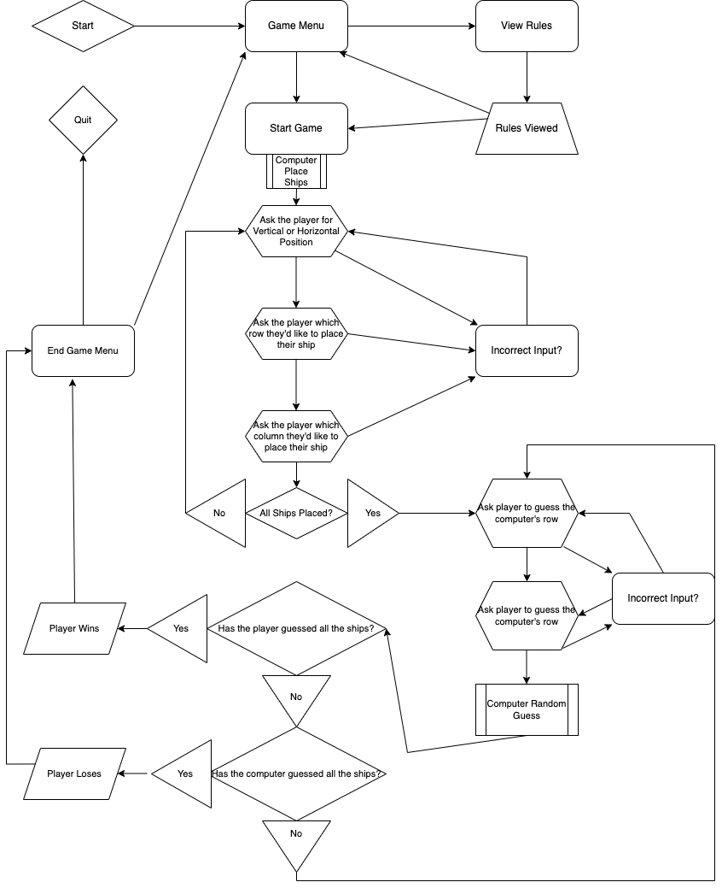

### Colour

#### Terminal Colours
The colours within the game itself has been provided using the Colorama library for Python. The library provides us with a set of basic colours; of which I selected a few and created a class in a unique python file so they could be accessed from the main game easily.

Terminal Colours

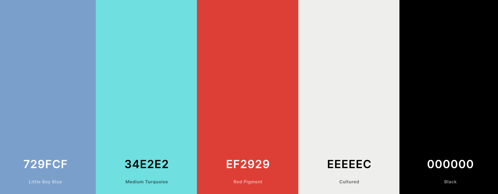

I decided to opt for the colours as they, to me, stood out as the classic game colours. Red vs Blue for user vs computer; a neutral cyan colour to indicate menus and game controls and classic black and white for usual terminal look.

#### HTML Background
The colours I decided for the background of the game when viewed on the deployed Heroku we're inspired directly from the game colours itself.

HTML Background

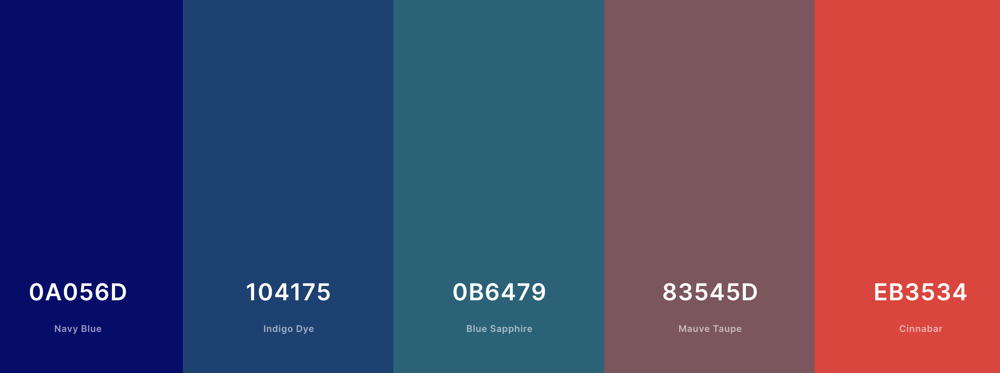

The colours are a simple fade of the colours used in the game, but feature a more vivid variation. I think the colours used really help the game to pop. 

## Main Features

### Title & Main Menu
The title and the main menu is the opener to the game and displays to the user using visually pleasing colours and simple commands to allow the user to know exactly what to do.

The title provides the user with the game's title using ASCII Art, and the game menu allows the user to choose some options to load into the game.

- User Stories: 1, 2, 8, 9

Heroku Screenshot

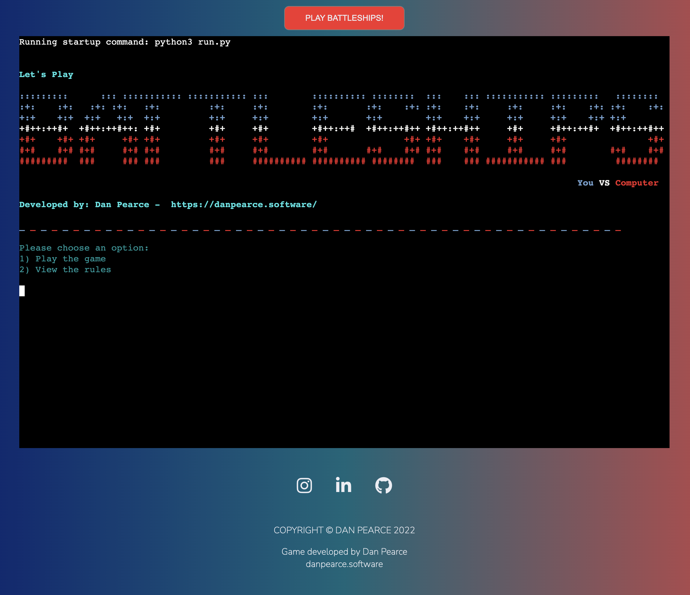

Title Screenshot

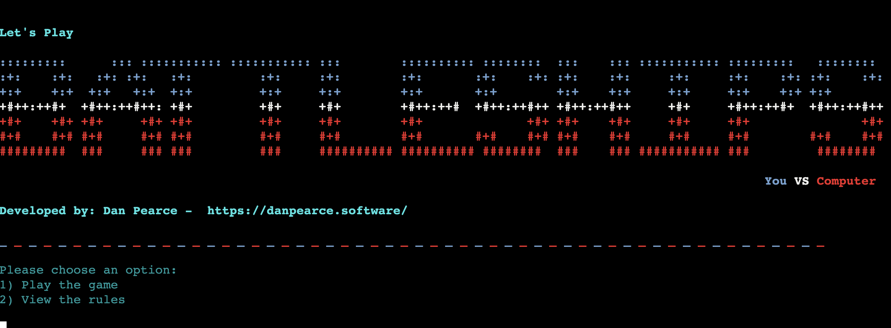

### Game Rules
The game rules are displayed to the user using time signals to allow the user to read them step by step. They are also displayed using colour to make it stand out to the user.

- User Stories: 3, 8, 9 

Rules Screenshot

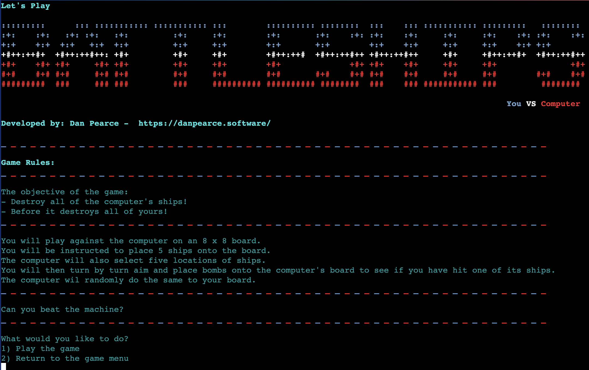

### Placing Board
The ability to place ships onto a board is a key feature to the game as this allows the user to viually see their ships on the board - and allows them to place them in any straticgic manor they wish.

- User Stories: 1, 8, 10

Start Screenshot

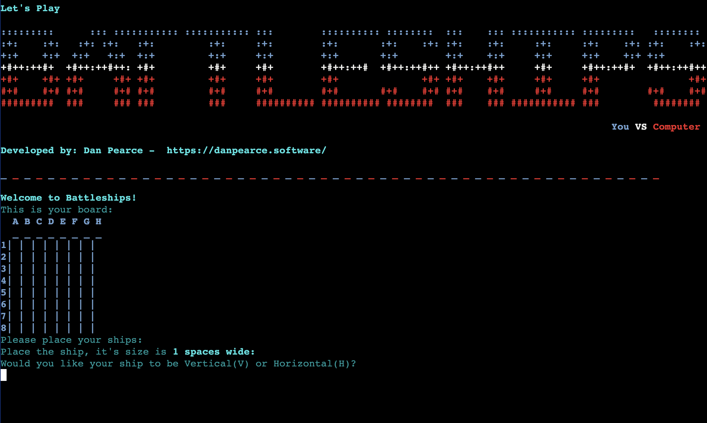

Placing Screenshot

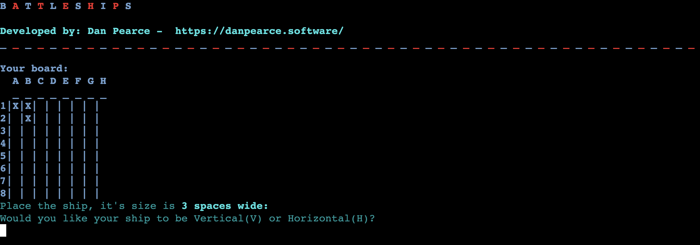

### Guessing Board
The ability to guess the opponants ships is another key feature to the game, allowing us to see visually if we have made a hit or a miss. This also allows us to see a real time board of both the user and the computer to see how likely we are to win!

- User Stories: 1, 8, 10

Placing Finished Screenshot

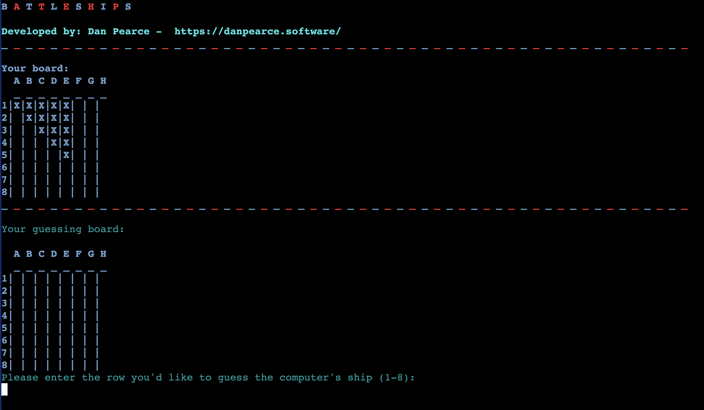

Mid-Game Screenshot

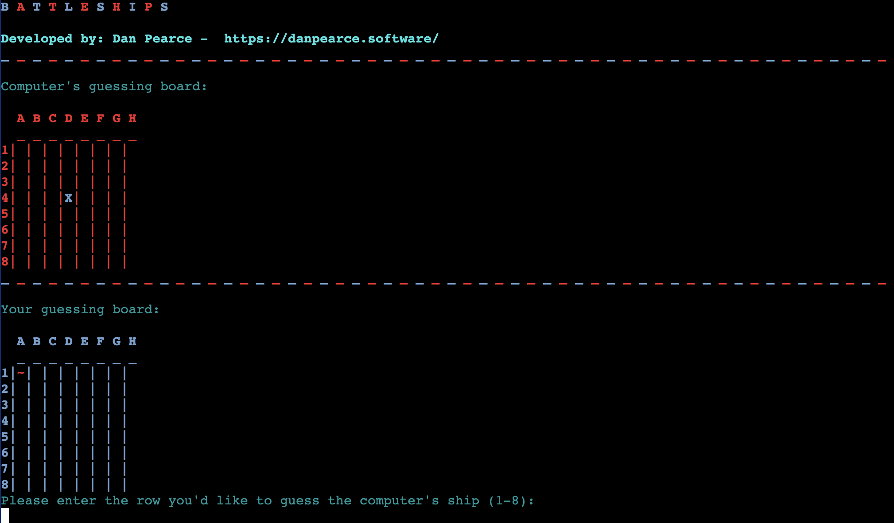

### Computer
The use of the computer as an opponant allows for us to create a unqiue game experience each time, this is because the computer will randomly place it's ships and also randomly select too! So every game is different!

- User Stories: 7, 11

Computer Guess Screenshot

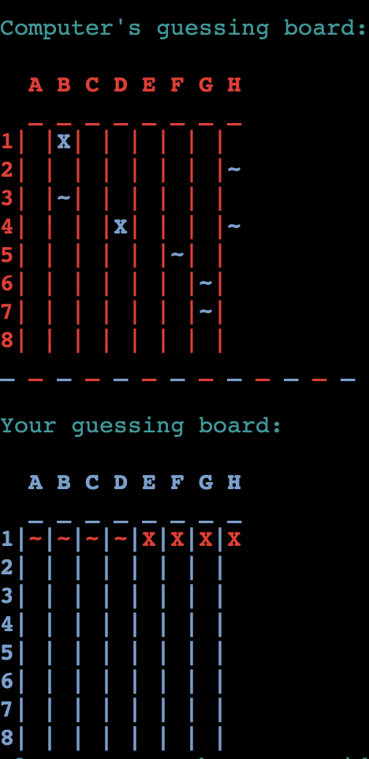

### Input Errors
The game has consistant visual feedback which will display to the user if there is ever a circumstance of input error. This provides the user a warning and details to them how to solve the issue and continue with the game.

- User Stories: 4, 9, 10

H/V Screenshot

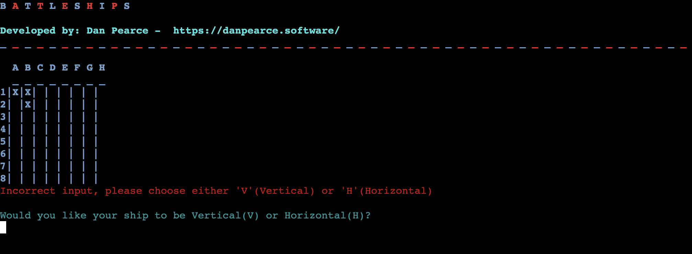

Number Screenshot

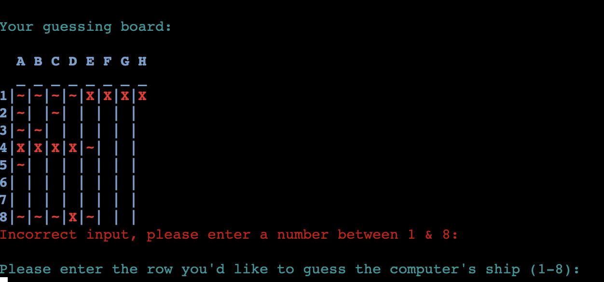

Letter Screenshot

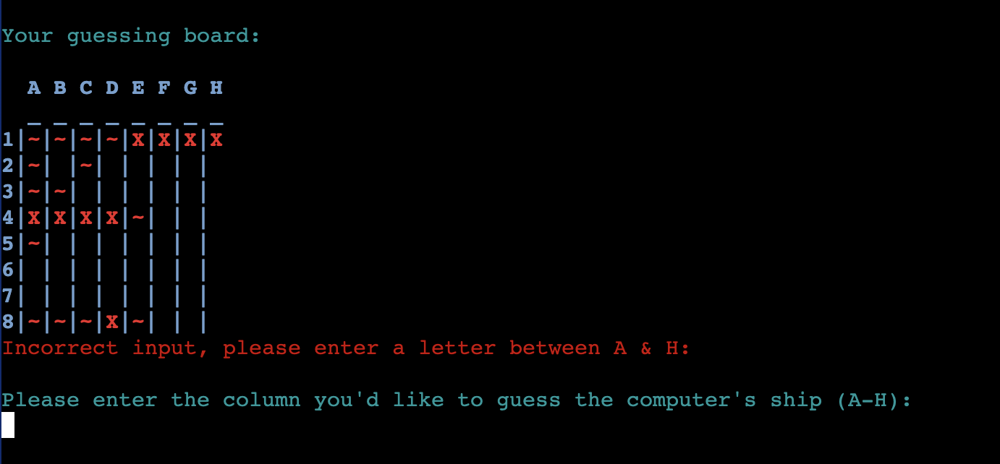

### End Game
The end game features the ability to tell the user if they have won or lost the game! Immediatly after this the user as asked if they would like to play again - which will reset the game and its boards - or to quit the game.

- User Stories: 5, 6, 12

End Game Quit Screenshot

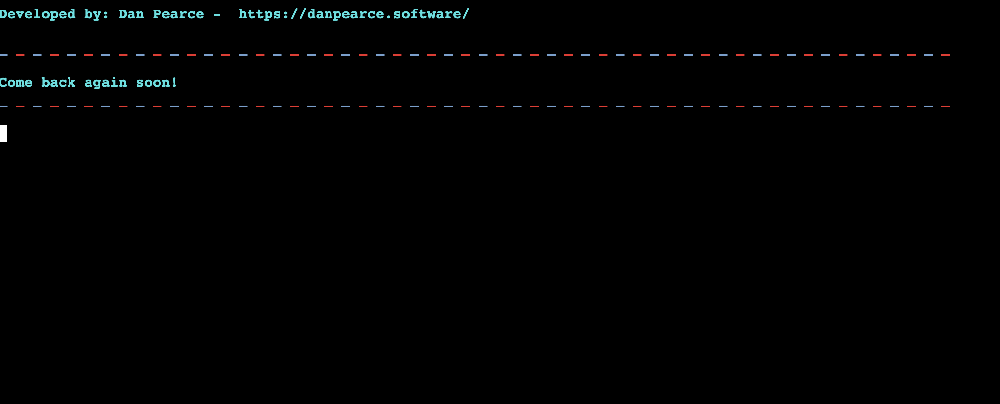

End Win Screenshot

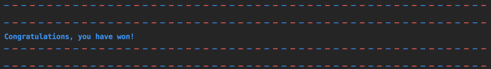

End Lose Screenshot

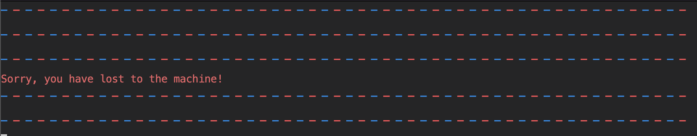

### Socials
The social media links can be found on the live version of the Heroku app, allowing users to get in touch.

- User Stories: 13

Social Screenshot

## Technologies

### Languages
- [Python](https://www.python.org/)
- [HTML](https://en.wikipedia.org/wiki/HTML5)
- [CSS](https://en.wikipedia.org/wiki/CSS)

### Libraries

#### Python Built-In Libraries
- random
- os 
- time

#### Third Party Libraries
- [Colorama](https://pypi.org/project/colorama/) - Justification - I decided to use this thrid party library as there is no built in featured library for colours in Python and I wanted to make the experience better for users.

### Frameworks and Other Technologies
- [GitHub](https://github.com/)
- [GitPod](https://www.gitpod.io/)
- [Heroku](https://www.heroku.com)
- [Font Awesome](https://fontawesome.com/)
- [Diagrams.net](https://app.diagrams.net/)
- [Google Chrome Developer Tools](https://developers.google.com/web/tools/chrome-devtools)
- [Google Fonts](https://fonts.google.com/)
- [Flaticon](https://www.flaticon.com/)

## Validation and Testing

### Python PEP8 Testing
The [PEP8 Validation Service](http://pep8online.com/) was used to check the Python Code against guidlines and best practices. All code has been returned with no errors.

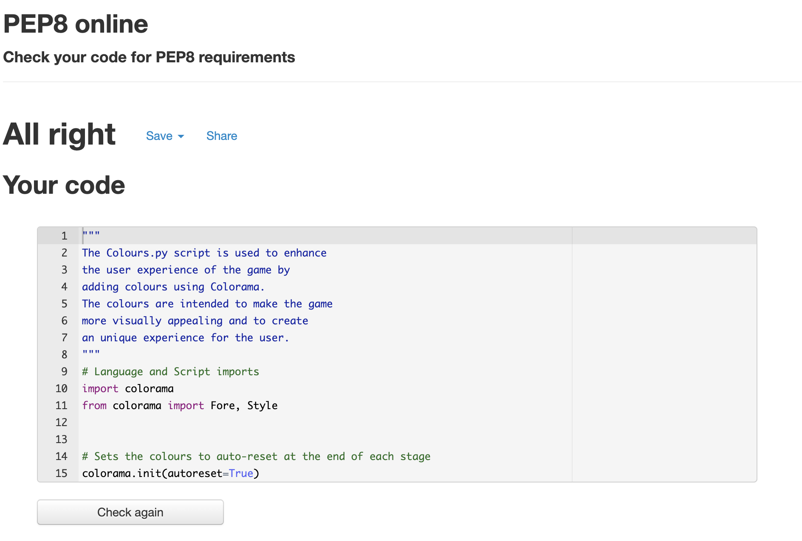

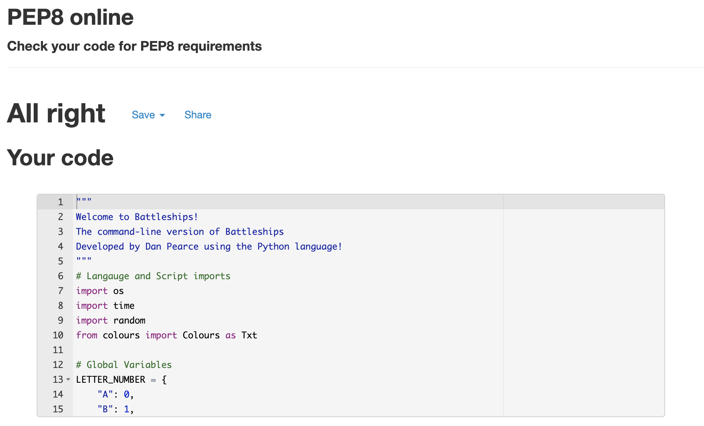

### User Story Testing

| **User Story 1** | **User Action** | **Desired Outcome** | **Actual Outcome** |
|------------------|-----------------|---------------------|--------------------|
| As a user, I want to be able to play the game Battleships. | Select play from the menu options | The game of Battleships starts. | Works as intended. | 
| 

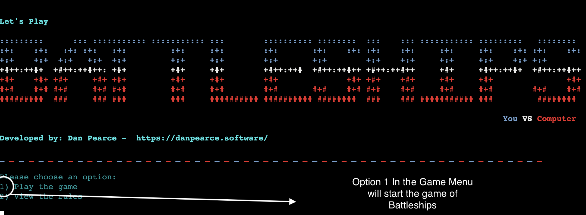
 | | | |

| **User Story 2** | **User Action** | **Desired Outcome** | **Actual Outcome** |
|------------------|-----------------|---------------------|--------------------|
| As a user, I want to easily navigate the main menu. | User to choose an option from the main menu, and examine its contents | The user is presented with a couple of options in the main menu which they can choose from. | Works as intended. | 
| 

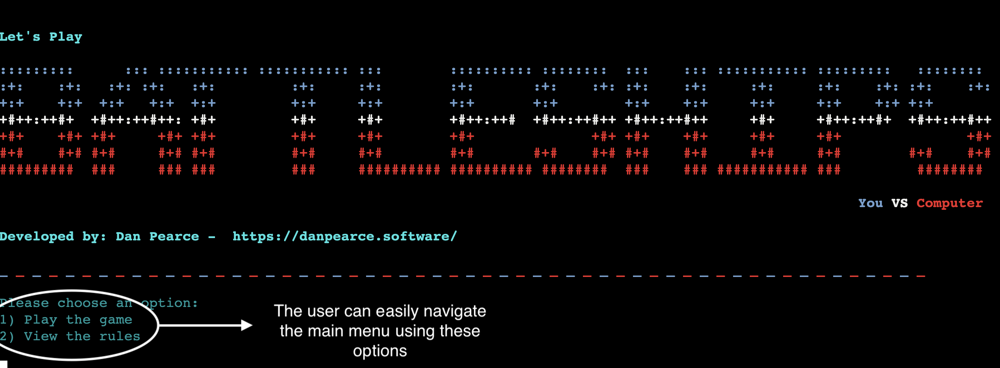
 | | | |

| **User Story 3** | **User Action** | **Desired Outcome** | **Actual Outcome** |
|------------------|-----------------|---------------------|--------------------|
| As a user, I want to read the rules of the game easily. | User selects the 'View the rules' option from the main menu | The user is displayed the rules of the game. | Works as intended. | 
| 

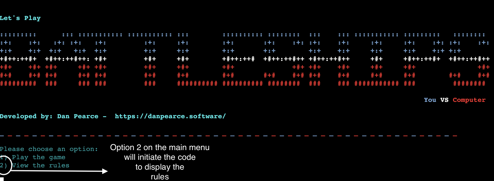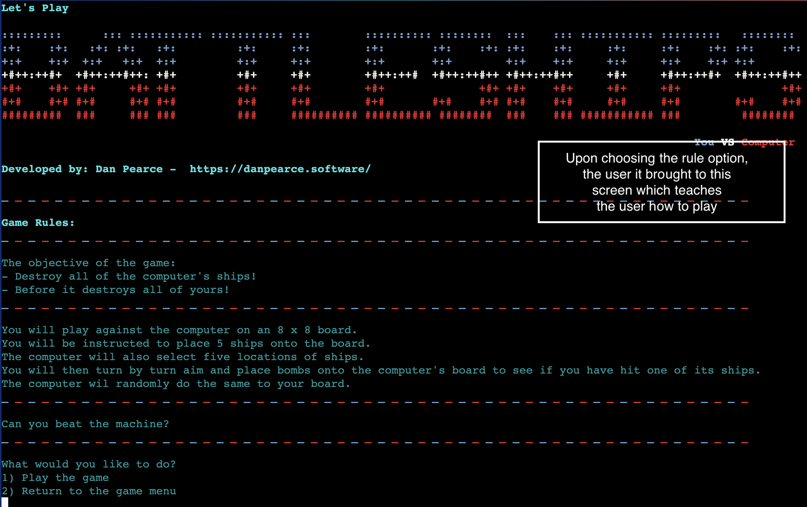
 | | | |

| **User Story 4** | **User Action** | **Desired Outcome** | **Actual Outcome** |
|------------------|-----------------|---------------------|--------------------|
| As a user, I want to be notified of any input errors throughout the entire game. | Incorrect user input | The user is presented with an error message in red when they attempt to input something that will lead to an error. | Works as intended. | 
| 

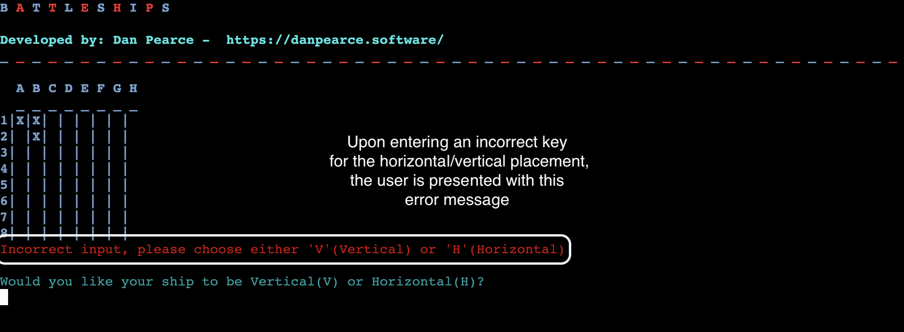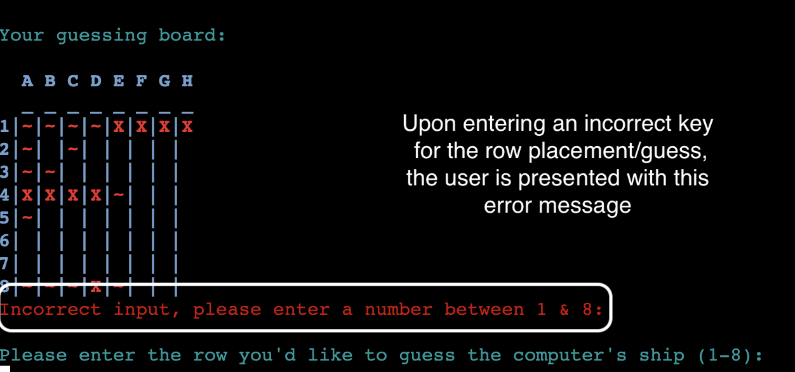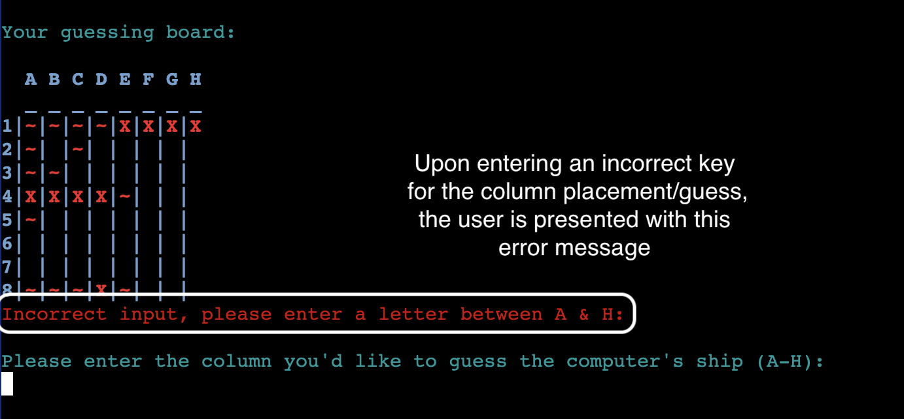
 | | | |

| **User Story 5** | **User Action** | **Desired Outcome** | **Actual Outcome** |
|------------------|-----------------|---------------------|--------------------|
| As a user, I want to have the option to play the game again without having to re-load the game. | User completes the game | Upon completion of the game the user can select return to main menu, which will reset the boards allowing them to select start game again. | Works as intended. | 
| 

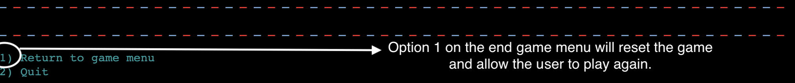
 | | | |

| **User Story 6** | **User Action** | **Desired Outcome** | **Actual Outcome** |
|------------------|-----------------|---------------------|--------------------|
| As a user, I want to be notified if I have won or lost. | User wins/loses the game | The user is brought to the end game screen, if they win, they are displayed a message informing them they have, if not the opposite. | Works as inteded. | 
| 

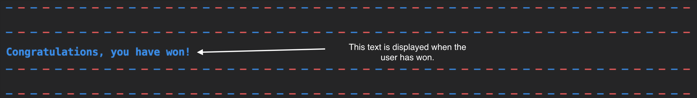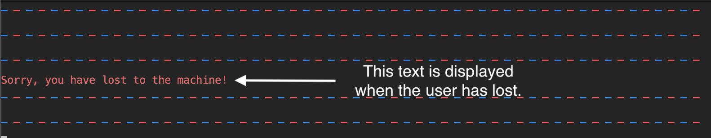
 | | | |

| **User Story 7** | **User Action** | **Desired Outcome** | **Actual Outcome** |
|------------------|-----------------|---------------------|--------------------|
| As a user, I want play a different game each time against the computer. | Play the game | The computer randomly generates a board each time the game is initiated. | Works as intended. | 
| 

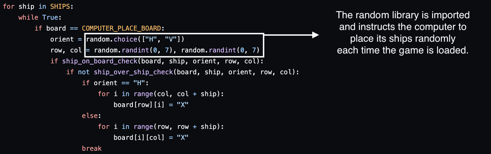
 | | | |

| **User Story 8** | **User Action** | **Desired Outcome** | **Actual Outcome** |
|------------------|-----------------|---------------------|--------------------|
| As an owner, I want to provide the user with an colourful and interactive game that they can play. | User loads the game, at any point. | Several colourful features have been implemented to make the game more interactive and the user can visually see their boards and game instructions throughout. | Works as intended. | 
| 

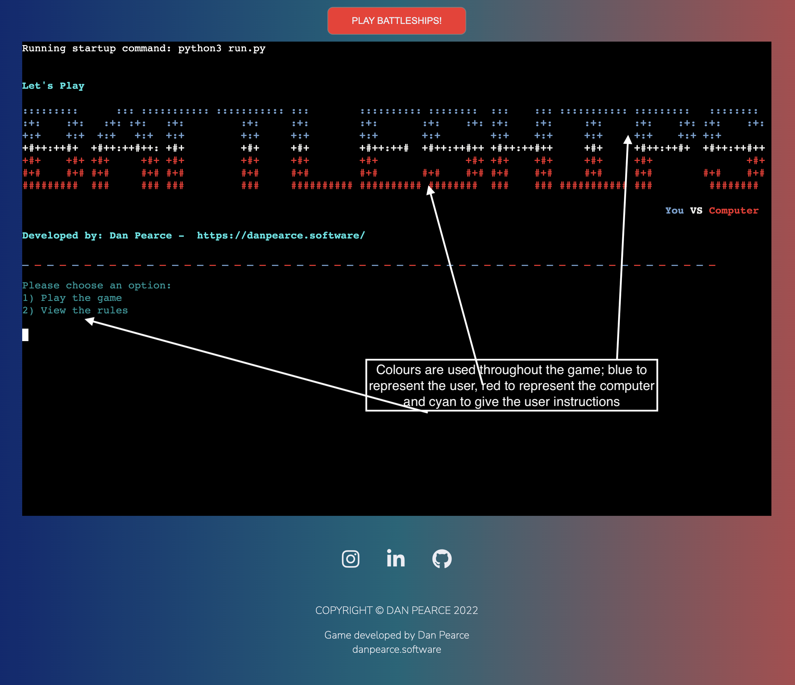
 | | | |

| **User Story 9** | **User Action** | **Desired Outcome** | **Actual Outcome** |
|------------------|-----------------|---------------------|--------------------|
| As an owner, I want to provide the user with easy to navigate menu and prompts throughout the game. | User come to any menu in the game | The menus are used at several points in the game to navigate the user back to the key areas - in order to give them key instructions on what they want to happen next. Game prompts are also used to instruct the user on how to move forward in the game. | Works as intended. | 
| 

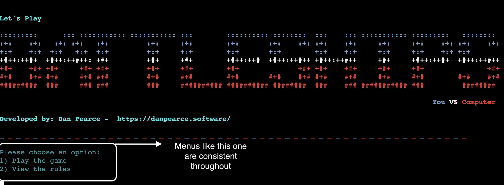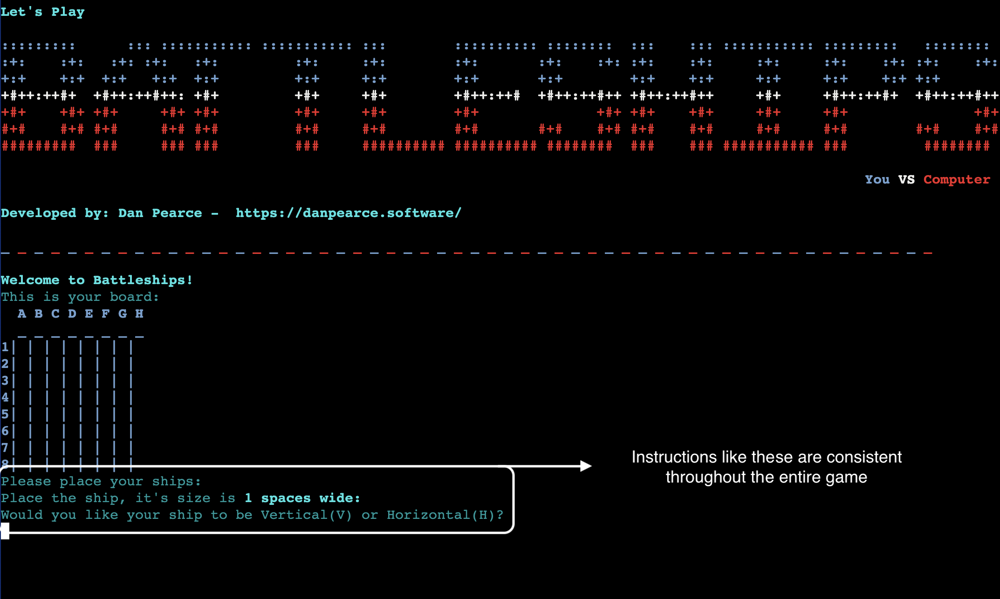
 | | | |

| **User Story 10** | **User Action** | **Desired Outcome** | **Actual Outcome** |
|------------------|-----------------|---------------------|--------------------|
| As an owner, I want to provide the user with visual feedback throughout the game. | User play the game / incorrect input | Throughout all stages of the game the user is provided with visual feed back, this is particuallary prominent when they place their ships on their board or onto the computer's board or if they make a mistake with user input. | Works as intended. | 
| 

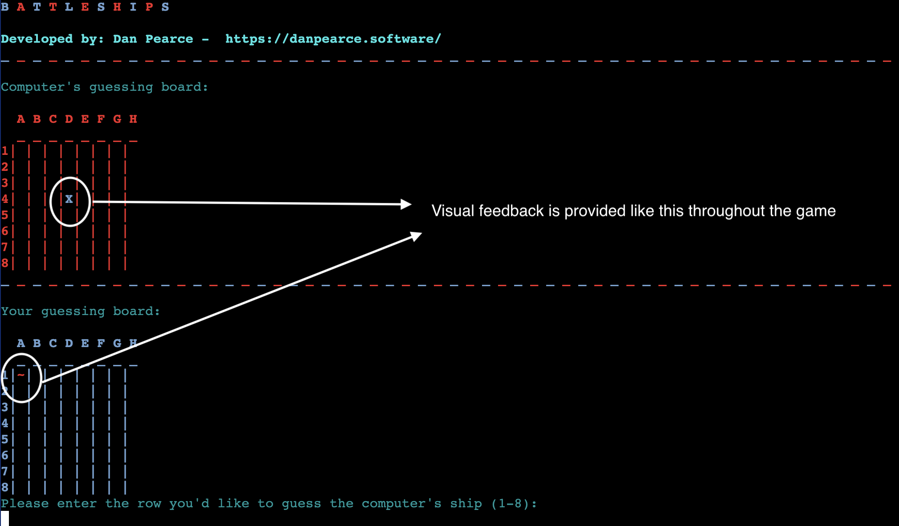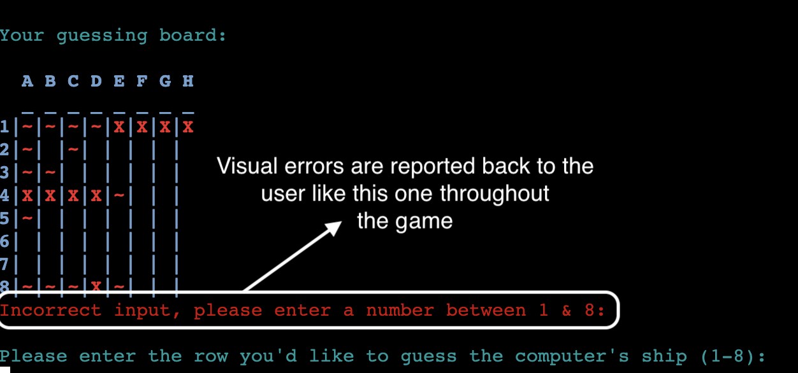
 | | | |

| **User Story 11** | **User Action** | **Desired Outcome** | **Actual Outcome** |
|-------------------|-----------------|---------------------|--------------------|
| As an owner, I want to provide the user with a different experience each time they play the game. | Play the game | The computer randomly generates a board each time the game is initiated. | Works as intended. | 
| 

 | | | |

| **User Story 12** | **User Action** | **Desired Outcome** | **Actual Outcome** |
|-------------------|-----------------|---------------------|--------------------|
| As an owner, I want the user to made aware if they have won/lost, and to allow them to quit the game. | User wins/loses the game | The user is informed if they have won or lost, then brought to the end game menu which allows them to select the quit option. | Works as intended. | 
| 

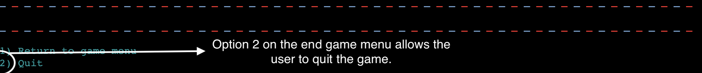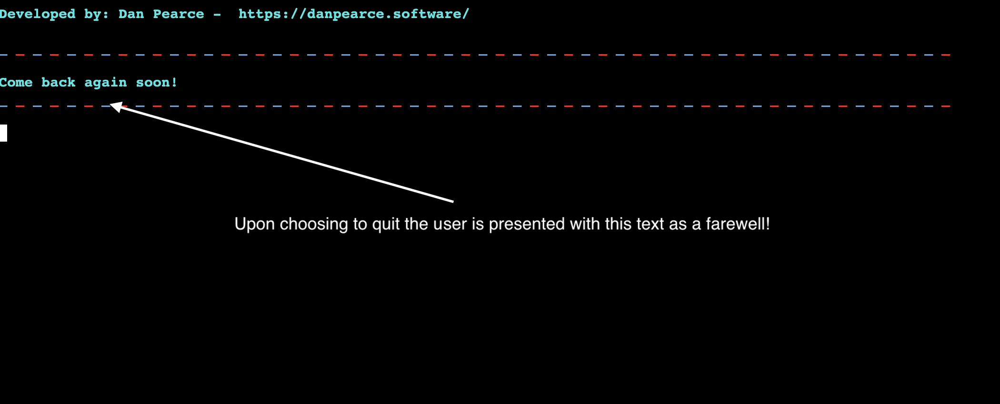
 | | | |

| **User Story 13** | **User Action** | **Desired Outcome** | **Actual Outcome** |
|-------------------|-----------------|---------------------|--------------------|
| As an owner, I want the user to be able to access my social media if they had any questions. | User load the game via Heroku | Underneath the game the social media area is clearly shown. | Works as intended. | 
| 

 | | | |

## Bugs and Errors

| **Bug/Error** | **Resolution** |
|---------------|----------------|
| Upon adding the Colour class to the boards on the move functions, I noticed that the scoring counter wasn't working as intended and players could always guess at the same location and the computer could too. | To fix this I had to add the class to the  areas that checked agaisnt the text so it could check they matched exactly as printed in the code. |
| After loading favicon from [favicon.io](https://favicon.io) and all its images to GitPod I noticed, that it was not loading onto the webpage. | After attempting to move files, and change directories with no success I opted to use Flaticon instead as the image could be sourced online |
| When loading the game again after winning, I noticed that the boards had not reset, which would cause major game complications if the user had to play again. | I decided to create a function that reset all the boards after the game had completed fixing the issue |

## Deployment
This application was deployed to Heroku via the Heroku Command Line Interface(CLI).

### Heroku Application Set-up
1. Sign into [Heroku](https://www.heroku.com) and create a new application.
2. From the new application's page on Heroku, navigate to settings.
3. Under the Config-Vars option - set the key too 8000, and the contents of 'VALUE' to the entire contents of the creds.json file.
4. Under the Buildpacks option - Add Python and NodeJS to the application - ensuring to make sure Python is on top of NodeJS.

### Deployent to Heroku Via CLI/GitPod
1. Download and install the [Heroku CLI](https://devcenter.heroku.com/articles/heroku-cli) client either to your machine or install your working IDE - I used GitPod.
2. Log in to Heroku using the command "heroku login -i" - Which then prompts you for your email and password.
3. Once logged in, I could use the command "heroku apps" to find the name of my application.
4. After knowing the name of my application I was able to set up heroku remote by using the command "hero git:remote -a <name-of-my-app>".
5. Then using command "Pip3 freeze > requirements.txt", I made sure that any requirements that are needed to be read by Heroku are added to the requirements.txt file.
5. Then commit any changes and push the changes to GitHub.
6. Using command "git push heroku main" - allowed me to deploy the application to the live site - once waiting for the site to build the application could then be used.

There are alternative methods of deployment, however due to secuirty reasons some features have been disabled on Heroku's website for the time being.

## Credits

### Colours and Artwork
- [Text to ASCII Art Generator](https://patorjk.com/software/taag/) by [Patojk](http://patorjk.com/) - Was used to generate the title art that was used in the game.
- [CSS Gradient](https://cssgradient.io/) was used to create the background image CSS for the gradient viewable on the HTML page.
- [Flaticon](https://www.flaticon.com/premium-icon/ship_870119?term=ship&page=1&position=13&page=1&position=13&related_id=870119) was used as a favicon for the web page.

### Code
- [Learning Python](https://www.oreilly.com/library/view/learning-python-5th/9781449355722/) by [Mark Lutz](https://www.oreilly.com/pub/au/446) was used to broaden my knowledge in the Python language.
- [Clear Screen Python](https://www.geeksforgeeks.org/clear-screen-python/) article was used to help me understand how to clear the Python program.
- [How to Print Colours in Python](https://www.youtube.com/watch?v=u51Zjlnui4Y&ab_channel=TechWithTim) by [Tech With Tim](https://www.youtube.com/channel/UC4JX40jDee_tINbkjycV4Sg) on YouTube provided me with a great tutorial on how to use Colorama and the colours in Python.
- [Programiz](https://www.programiz.com/) helped me to understand the concepts of [Classes](https://www.programiz.com/python-programming/class) in Python and the [Sleep](https://www.programiz.com/python-programming/time/sleep) function too.
- [Knowledge Mavens](https://www.youtube.com/c/KnowledgeMavens1) helped me to understand the logic behind creating a game of Battleships in Python.
- [Python GSpread Tutorial](https://www.youtube.com/watch?v=ddf5Z0aQPzY) by [Frank Mularcik](https://www.youtube.com/channel/UCNNBD6VYfwKHVeV2krJjVmw) on YouTube was used to help me understand how to use Google Sheets API.

## Acknowledgements
I would like to thank:
- Mo Shami, my mentor throughout the project, who has provided me valuable information.
- My partner, Harry, who continues to be my rock throughout my learning process and takes the cats off my hands while he's home <3!
- Anyone who continues to support my effort to learn and improve my abilities in software development.
